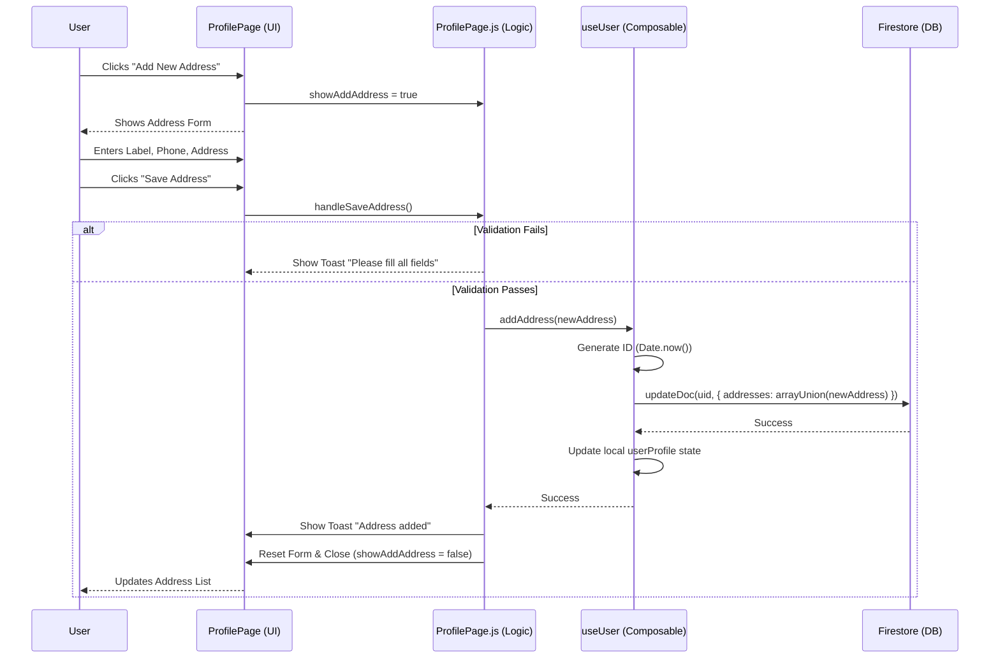

# Add Address Flow Documentation

This document outlines the process of adding a new address from the Profile Page in the AuraShop application.

## 1. Data Structure

The address data is stored within the `userProfile` object in Firestore. Each user document contains an `addresses` array.

**Address Object:**
```typescript
interface Address {
    id: string;          // Unique identifier (generated using Date.now())
    label: string;       // e.g., "Home", "Work"
    addressLine: string; // Full address text
    phoneNumber: string; // Contact number for this address
}
```

## 2. Process Flow

> **Note:** To view the rendered diagram, open `address_flow.html` in your browser.



## 3. Detailed Steps

1.  **User Interaction**: The user navigates to the "Address Book" section of the Profile Page and clicks the "Add New Address" button.
2.  **State Change**: The `showAddAddress` reactive variable in `ProfilePage.js` is set to `true`, causing the input form to render.
3.  **Data Entry**: The user fills in the `label`, `phoneNumber`, and `addressLine` fields. These are bound to the `newAddress` ref.
4.  **Submission**: The user clicks "Save Address", triggering `handleSaveAddress`.
5.  **Validation**: The function checks if all fields are populated. If not, a warning toast is displayed.
6.  **Composable Call**: `addAddress` from `useUser.ts` is called with the form data.
7.  **Database Update**:
    - A new ID is generated.
    - `updateDoc` is called on the user's Firestore document.
    - `arrayUnion` is used to append the new address to the `addresses` array without overwriting existing ones.
8.  **Local State Update**: The local `userProfile` state is updated immediately (optimistic/reactive update) to reflect the change in the UI.
9.  **Completion**: A success toast is shown, the form is cleared, and the "Add Address" section is collapsed.
